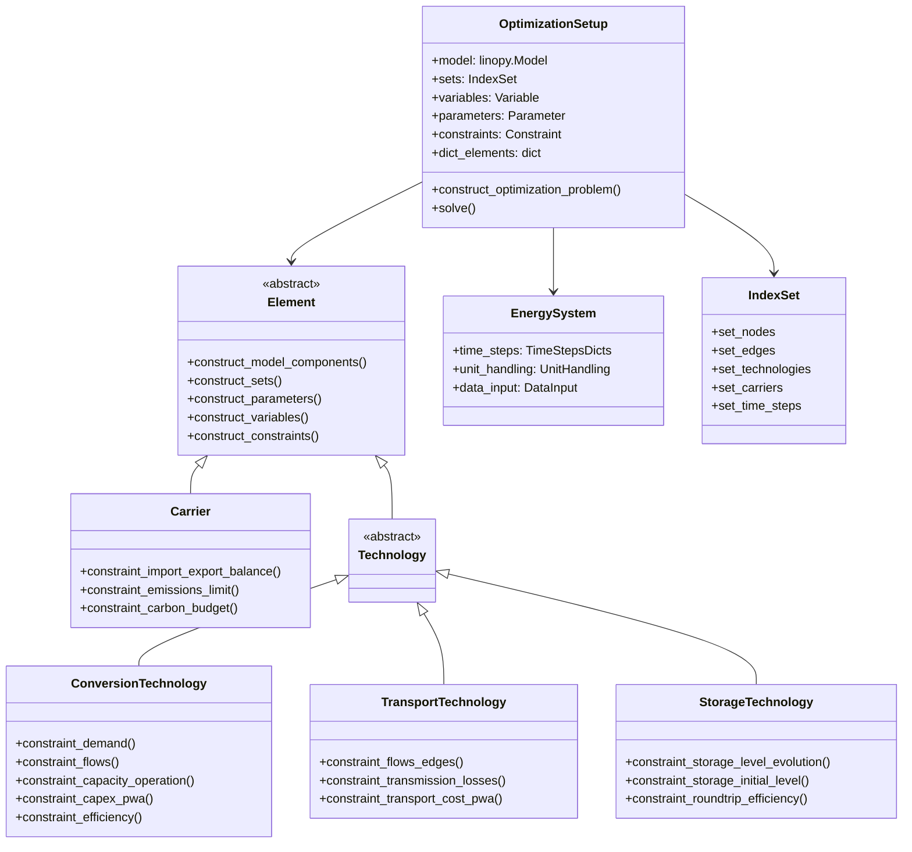
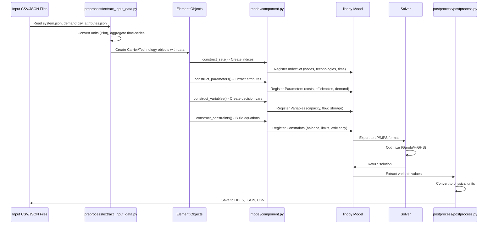
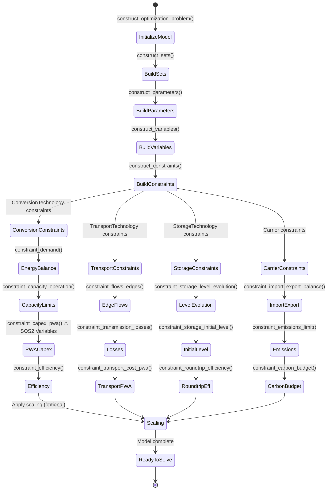
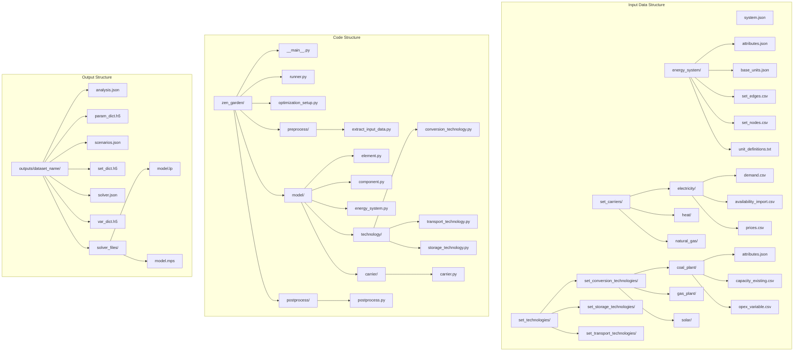

# ZEN-Garden Architecture - Mermaid Diagrams

## 1. Execution Flow (Main Process)

```mermaid
flowchart TD
    A[User runs zen-garden --dataset=X] --> B[__main__.py]
    B --> C[runner.py run()]

    C --> D[Load config.json]
    D --> E[Validate dataset exists]
    E --> F[Extract scenarios]

    F --> G{For each scenario}
    G --> H[Create OptimizationSetup]

    H --> I{For each rolling horizon step}
    I --> J[construct_optimization_problem()]

    J --> K[Initialize linopy Model]
    K --> L[Reset component registries]
    L --> M[Element.construct_model_components()]

    M --> N[construct_sets()]
    N --> O[construct_parameters()]
    O --> P[construct_variables()]
    P --> Q[construct_constraints()]

    Q --> R[Apply scaling if enabled]
    R --> S[solve() - Call solver]
    S --> T{Check optimality}
    T --> U[Postprocess results]
    U --> V[Save to HDF5/JSON]

    V --> W[Next horizon step?]
    W -->|Yes| I
    W -->|No| X[Next scenario?]
    X -->|Yes| G
    X -->|No| Y[Done]
```

## 2. Component Hierarchy (Class Diagram)



## 3. Data Flow (Sequence Diagram)



## 4. Constraint Building Process (State Diagram)



## 5. File Structure Overview



## 6. Key Methods Call Flow

```mermaid
flowchart LR
    subgraph "Entry Point"
        A[runner.py run()]
    end

    subgraph "Scenario Loop"
        B[For each scenario]
        C[OptimizationSetup()]
    end

    subgraph "Horizon Loop"
        D[For each horizon step]
        E[construct_optimization_problem()]
    end

    subgraph "Model Building"
        F[Element.construct_model_components()]
        G[construct_sets()]
        H[construct_parameters()]
        I[construct_variables()]
        J[construct_constraints()]
    end

    subgraph "Technology Constraints"
        K[ConversionTechnology.construct_constraints()]
        L[TransportTechnology.construct_constraints()]
        M[StorageTechnology.construct_constraints()]
    end

    subgraph "Solver & Results"
        N[solve()]
        O[Postprocess]
    end

    A --> B
    B --> C
    C --> D
    D --> E
    E --> F
    F --> G
    G --> H
    H --> I
    I --> J
    J --> K
    J --> L
    J --> M
    K --> N
    L --> N
    M --> N
    N --> O
```

## Usage Instructions

1. **Copy each Mermaid code block** into a Mermaid-compatible tool:
   - [Mermaid Live Editor](https://mermaid.live/)
   - GitHub/GitLab (supports Mermaid natively)
   - VS Code with Mermaid extension
   - Draw.io (import Mermaid)
   - Notion, Obsidian, etc.

2. **For Draw.io import**:
   - Go to Draw.io
   - File → Import → Mermaid

3. **For documentation**:
   - These diagrams show the complete ZEN-garden architecture
   - Flowcharts show execution order
   - Class diagrams show inheritance
   - Sequence diagrams show data flow
   - State diagrams show constraint building process</content>
<parameter name="filePath">c:\Users\felix\Documents\GitHub\ZEN-garden\ZEN_Garden_Architecture_Diagrams.md